::::::: titlepage
::: minipage
**Final Report for the Practical Project:\
RAG Augmented Shell Honeypot for middle-sized companies** \
:::

::: minipage
{width="\\linewidth"}
:::

:::: minipage
::: flushleft
  -----------------------------------------------------------------------------------------------
  **presented by**
  Jorge Estrada
  Student nr.: S1003450
  **to**
  the department VI --- Informatics and Media --- of the Berliner Hochschule für Technik Berlin
  as part of the regular program
  **IT-Sicherheit Online**
  for the course Praxisprojekt SS-26
  **submitted on**
  2026-07-01
  version 0.1$\alpha$
  last changed: 2026-07-01
  **Gutachter or Evaluator**
  Prof. Dr.-Ing. Stefan Edlich Berliner Hochschule für Technik
  -----------------------------------------------------------------------------------------------
:::
::::
:::::::

# Statutory Declaration {#statutory-declaration .unnumbered}

I hereby declare that this project and report are product of my
independent work and that no other person collaborated beyond giving the
necessary feedback for the deployment at the pharmaceutical company
Pentixapharm. The idea, approach, and design in this implementation were
product of my creativity. The works that have been drawn for scholarly
discussions have been clearly marked and acknowledged through citations
and references. The sources are listed in the bibliography. The same
applies to all charts, diagrams and illustrations, as well as to all
internet resources. Moreover, I consent to my report being
electronically stored and sent anonymously in order to be checked for
plagiarism.

The content of this text was not enhanced with the aid of LLMs. No
prompts were made to conceive the main idea nor its parts. The grammar
and spelling were proofread with the engine built-in in overleaf, but
not enhanced with AI writing. In the implementation, I relied in various
AI tools for debugging and adapting the configuration or source code. In
all cases that an AI was employed, it is mentioned and documented in the
text. The AI Lumo was also used to transform the citations to fit the
format require for the overleaf literature.bib file.

+:-------------------------------------------------------------------------+
| ------------------------------------------------------------------------ |
+--------------------------------------------------------------------------+
| *Signature*                                                              |
+--------------------------------------------------------------------------+
| ------------------------------------------------------------------------ |
+--------------------------------------------------------------------------+
| *Place, Date*                                                            |
+--------------------------------------------------------------------------+

# Task at Hand

This project has a twofold purpose. On the one hand, it wishes to
reflect on possible implementations of Large Language Models (LLMs) in a
defensive setting in cybersecurity. On the other, it focuses on a
hands-on approach and aims at gaining practical insights for deployments
in real life scenarios. With this purpose in mind, my project focuses on
Honeypots. These are emulated services or systems that attract and
interact with attackers to waste their resources while acquiring
information about attack vectors. Research and development of Honeypots
is on the rise due to its possible enhancements with LLMs, which promise
to fine tune Honeypot's interactions.

In tune with this trends, this project endeavored to deliver a prototype
of a Retrieval-Augmented Generation (RAG) Honeypot. This prototype was
conceived as a tool to be deployed within the network of mid-sized
companies. In this manner, any attacker that breaks into the network
would easily take the bait, interact with the Honeypot, and its actions
could be swiftly analyzed and identified when coupled with a Security
Information and Event Management (SIEM) system. For the ease of
deployment within a system with modest capacities as those of a mid-size
company, this prototype was developed with containerization technology.
The prototype is light-weight and can be set up with docker in a matter
of minutes and relies on a HuggingFace to choose a small and fast model,
LangChain to orchestrate the prompt pipeline and retrieval from a
chromadb vector database.

The prototype represents an implementation of Cowrie, which is a SSH
Honeypot, coupled with an Elasticsearch, Logstash, and Kibana (ELK)
Stack, as well as with a conversational LLM model that runs locally with
a vector database. Although the requirements are kept to the minimum,
the host machine must still have a GPU with at least 2 GB of dedicated
memory to be fast enough to trick an attacker.

# Theoretical and Technical Groundwork

## An abridged Honeypot definition

Further developing and reflecting on Honeypots represents the
theoretical core in this project and prototype. Honeypots emulate
legitimate systems or services with evident vulnerabilities. By doing
so, they act as bait and aim at attracting the attention of attackers.
The main objective, summarized from key surveys
[@franco_survey; @ilg_survey; @javadpour_survey], is to make an attacker
waste its resources while interacting with this bogus system, gather
information about the adversarial tactics employed, and gain time for an
appropriate response by the cybersecurity team. Depending on their
complexity and ability to emulate real systems, Honeypots are divided in
Low, Medium, and High Interaction Honeypots. The latter is the most
relevant for this project, since they can keep an adversary engaged for
longer periods of time. These levels of interaction are directly related
to the resources invested in a Honeypot. For instance, one could even
use an actual system as a Honeypot by providing it with spurious data
and configurations, and monitoring it. However, such approach could come
with a high financial and configuration toll. This is exactly the
consideration that leads us to Honeypots and, more importantly,
containerization. Containerization and also virtualization allow for
swift and light-weight deployments.

This idea of portable and efficient traps represents the backdrop
against which the enhancement of Honeypots with LLMs move. At this point
is crucial to highlight that both the offensive and defensive
possibilities available to explore with AI are changing the
cybersecurity landscape. More than scanning or probing for
vulnerabilities or automating monitoring and analysis, LLMs can become
real actors and their interactions would become game changing. Not only
the attack rate will increase; the complexity and depth will improve, so
that one could expect a cybersecurity arena where resources invested in
running probing and offensive AIs would need to be meet with their
equally complex, defensive counterparts. LLM-enhanced Honeypots would
help extend the time an attackers spends interacting with it
[@learning_honeyp_downling] or even discover and adapt to the
vulnerabilities that the attacker is trying to exploit
[@Wagener_adaptive_game_theory].

The present prototype attempts to delve into this possibility.

## Technologies involved

The implementation involves the containerization provided by Docker, so
basic knowledge to handle and configure and run containers as well as
editing yaml files is required. The version management was handled in
Github and the project is available at
<https://github.com/limemime/Praxis-Projekt-BHT-SSH-Honeypot-LLm>. The
rag-proxy was developed by relying on various sources online and the
official documentation in
<https://huggingface.co/docs/transformers/model_doc/rag> and
<https://docs.langchain.com/oss/python/integrations/providers/huggingface>.
The rag-proxy was implemented through Python libraries and the debugging
required to fine tune the Cowrie configuration with a Python program, so
basic programming knowledge is needed. To handle the ELK Stack and
configure the aggregation and normalization, one also needs to delve
into the configuration files. All in all, the implementation reached at
the current stage a point where deployment is relatively simple and
requirements low enough to be able to run this even from a laptop. For
the project I used a system provided by the company with following
specifications:\
\

<figure data-latex-placement="htpb">
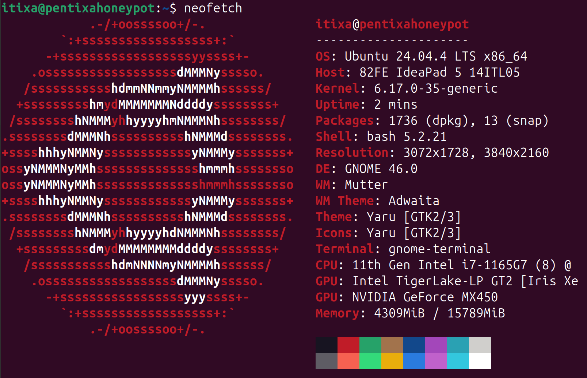
<figcaption>Generated with neofetch command</figcaption>
</figure>

# Analysis

In the following subsection, a brief analysis of the project is
sketched.

## Practical Objective

The main idea of this project is to develop a LL- enhanced Honeypot that
is portable enough to be easily deployed in mid-size companies and, in
this manner, bolster up cybersecurity. Ideally it should be with some
alarms to indicate when an attack is taking place. Central for this
project is the RAG-proxy, because only High Interaction Honeypots
configurable with custom settings would be able to withstand the
automated fingerprinting and perusal by sophisticated attackers with AI
capabilities.

## Resources

Since this project is developed as part of university studies and of the
activities as working student at a pharmaceutical research company, the
costs are kept as a minimum. The main investment is the time to develop
the project and test it. The computer to work on this project was
repurposed from the company's inventory.

## Stakeholders

- **Developer** and student who has the main responsibility for the
  project

- **IT-Admin** from the company who accepted the project and offers
  feedback.

- **Lecturer** that oversees the course devoted to the practical project
  at the BHT.

- **Companies** that might be interested in increasing their defensive
  measures might find the project appealing.

- **Other developers** that might be interested in customizing or
  enhancing this project.

## Market

There is plenty of ongoing research on Honeypots and LLMs, but there are
currently not well established deployments or implementations. There is
one SSH Honeypot enhanced with AI, which is Beelzebub. This was not
tested for the project. Instead it focused on Cowrie. Cowrie is a well
established Honeypot and although it has a experimental module to serve
as an interface to LLMs, it is far from functional, as this project
revealed.

## Target Concept

### Prototype

This prototype is a service set deployed with Docker and containing
Cowrie, ELK Stack, and a rag-proxy with chromadb. Its main function is
to enhance the way in which Cowrie mimics the responses form an actual
system and entice the attacker to keep the interactions by showing
vulnerabilities and a desirable payoff from the attack.

### Tech Stack

- Docker

- Python 3

- ELK

- Expect Script

### Legal Liability

In some countries a system cannot encourage to commit a cybercrime or
upload malicious files like a honeyfile or honeytoken containing false,
traceable credentials. To avoid legal disputes it is important to
control and test that the Honeypot responses remain within the
boundaries of a mimicking device. However, it is important to note that
whoever logs in to the honeypot has made a brute-force attack, so they
are not acting within the legal bounds.

### Roadmap

1.  Iteration \"Hello sweet, honeyed World\"

    - To Implement: \"bare bones\" Cowrie in docker

    - Milestone: docker compose up and connect to SSH

2.  Iteration \"Logging capabilities\"

    - To Implement: Cowrie with ELK Stack

    - Milestone: Script produces log traffic in Kibana

3.  Iteration \"RAG-enhancement\"

    - To Implement: Cowrie, ELK, rag-proxy

    - Milestone: All containers up and running

4.  Iteration \"First functional debugging\"

    - To Implement: Debugging for functionality

    - Milestone: Connect, Exit, appropriate timeouts in Honeypot

### Use Case

The most straightforward use expected for this project is as follows:

<figure data-latex-placement="htpb">
<embed src="./figure/eraser_Use_case_Cowrie RAg.pdf" />
<figcaption>Generated with Antigravity AI and Eraser</figcaption>
</figure>

# Design

Since this project was from the beginning part of a research and
learning process, the initial design focused on basic functions and
afterwards more functional layers were added. This means that the
initial design was a husk and the original idea changed along the way.

The first element was Cowrie, which was in the docker-compose.yml file
and also had a configuration file:\
\|--- docker-compose.yml

\|--- cowrie.cfg\
Afterwards came the ELK-Stack deployment, for which I followed the
architecture proposed by the developers in
<https://www.elastic.co/blog/getting-started-with-the-elastic-stack-and-docker-compose>
and added it to my structure:\
\|--- cowrie.cfg

\|--- docker-compose.yml

\|--- .env

\|--- filebeat.yml

\|--- logstash.conf

\|--- metricbeat.yml\
To this structure one must also add a kibana.yml. While the
docker-compose.yml deals with the orchestration and serves to mount the
volumes, the component-specific .yml files configure the application. In
this structure there is also a hidden .gitignore that keeps the .env
from actualizing and revealing our keys to anyone visiting the
repository.

Elastic is enhancing the stack to include both a Fleet, which gives
central control over servers and bolsters up orchestration, and an
Application Performance Monitoring (APM) service, which collects data
from agents and promises to help with debugging and error tracing. Since
the Fleet and the APM lay the groundwork for scalability and adding more
type of honeypots, they were also integrated in the project alongside a
minimal app that serves as a health-check. The structure, which comes in
the second part of the elastic implementation
guideline(<https://www.elastic.co/blog/getting-started-with-the-elastic-stack-and-docker-compose-part-2>),
is as follows:\
\
\|--- app

\|--- dockerfile

\|--- main.py

\|---requirements.txt

\|--- cowrie.cfg

\|--- docker-compose.yml

\|--- .env

\|--- filebeat.yml

\|--- kibana.yml

\|--- logstash.conf

\|--- metricbeat.yml\
At this point the design has working version of a cowrie Honeypot that
can be monitored through the ELK-Stack and with the option to also
monitor apps thanks to the fleet, and APM. This is exactly the point in
which one can start enhancing the implementation with a LLM.

The RAG enhancement is achieved with a proxy, which has a similar
structure to the health-check app. The dockerfile starts the uvicorn
server and installs the requirements for the main.py. This program is a
simple pipeline line that calls the models for the database embeddings
as well for the conversational LLM, sets quantization parameters to make
the program faster and with lower requirements, and finally wraps them
in LangChain with the HugginFacePipeline class. The final prompts fed
into the pipeline contain the input (handled as posts) from the
Cowrie-Honeypot, the context, which is the last 6 messages stored in the
chromadb, and a pinned context that is seeded to the database in order
to establish a baseline for the Honeypot. The Rag architecture can be
better comprehend by following the post message and how they are
enriched with context (see Figure 3 in the next page).

<figure data-latex-placement="htpb">
<embed src="./figure/Ragprox chart Mermaid.pdf" />
<figcaption>Diagram produced with Antigravity and Mermaid</figcaption>
</figure>

Besides the main architecture of the rag-proxy and the cowrie-elk
deployment, there are some ancillary components that are needed for the
prototype, such as the script seed.py that pins the baseline for the
Honeypot, a test script that creates traffic to populate the ELK logs,
and a program llm_modify.py to modify Cowrie so that its default
settings do not interfere with the RAG enhancement. The final structure
without .env and .gitignore is shown in the following page.

<figure data-latex-placement="htpb">
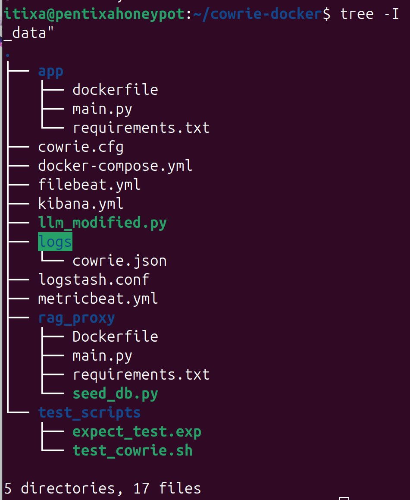
<figcaption>Screenshot from project’s host</figcaption>
</figure>

# Iterative Implementation & Quality Assurance

The implementation was truly a learn-by-doing process in which I kept on
adding different tools both for the project and also to manage it.
Before adding any further components, I tested at every step that the
components where working correctly, so this implementation mentions the
issues that appeared along the way. Throughout the implementation I
relied on the official documentation that is available online, which
will be mentioned when needed.

This project is available in a Git repository
(<https://github.com/limemime/Praxis-Projekt-BHT-SSH-Honeypot-LLm>). One
can see there the steps involved in creating and debugging this
prototype.

## Docker

Probably as the vast majority of practical projects in Informatics, this
one also began with a \"sudo apt install\". In this case, it was a
docker installation. The Community Edition CLI version was considered
better for this deployment, because its requirements are lower than the
Desktop version. The installation is straightforward and can be found in
the official documentation
<https://docs.docker.com/engine/install/ubuntu/>. Briefly put: 1) Set
the repository, certificates and key, 2) install docker with \"sudo apt
install\...\", 3) verify the installation with a hello-world image.

## Cowrie

Thanks to Docker, testing the containerized version of Cowrie requires
one simple command, which is provided in the official documentation
(<https://docs.cowrie.org/en/latest/docker/README.html>):
`docker run -p 2222:2222 cowrie/cowrie`. And a simple test
`ssh -p 2222 root@localhost`.

## ELK Stack

Things start becoming more complicated when adding the
Elasticsearch-Logstash-Kibana Stack
(<https://www.elastic.co/blog/getting-started-with-the-elastic-stack-and-docker-compose>
and see also <https://...docker-compose-part-2>).

The first step is to create the .env file for the project which contains
the basic configuration, like ports, encryption key, cluster name, etc.
Here I had a minor issue, because the first password I set did not meet
the required length. After the implementation simply follows the
official documentation. Some issues might arise, when adding more
volumes or services to the docker-compose.yml, because this type of
files are very sensitive with the indentation, so finding errors can
become a serious time investment.

I added Cowrie to the docker-compose.yml and make it depend on Kibana,
but the conditions was not necessary and was later erased:

<figure data-latex-placement="htpb">
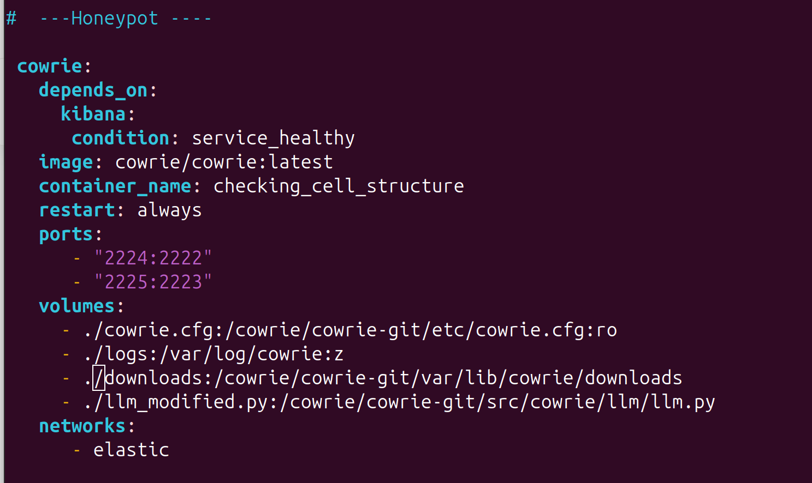
<figcaption>Screenshot from docker-compose.yml</figcaption>
</figure>

An issue I encountered many times was related to the fleet
configuration. For the fleet, one needs to set the address of
elasticsearch, create a fingerprint and also copy the elasticsearch
certificate. In the official documentation it sees thusly:

<figure data-latex-placement="htpb">
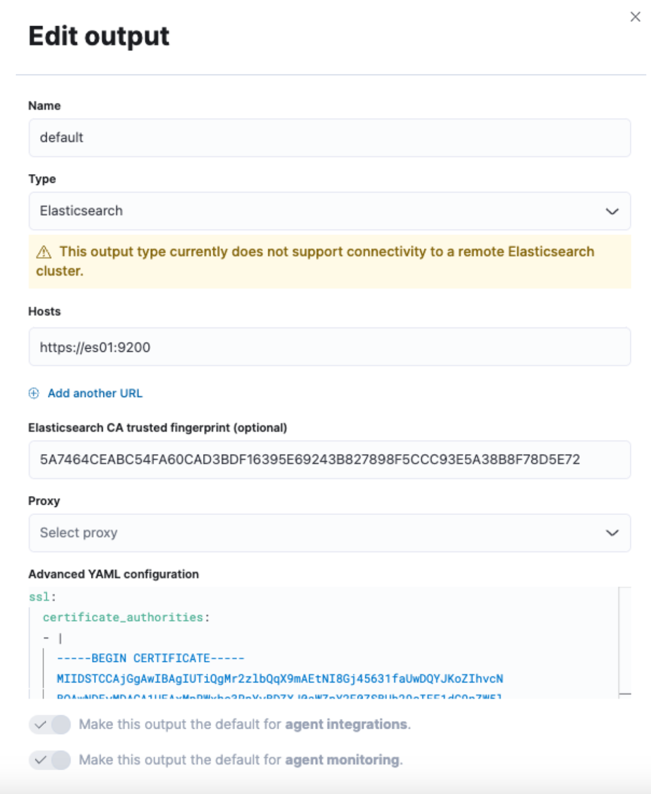
<figcaption>Screenshot from docker-compose.yml</figcaption>
</figure>

The problem here is pasting the certificate. One can copy it in a
temporary file with the command:
`docker cp es-cluster-es01-1:/usr/share/elasticsearch/config/certs/ca/ca.crt /tmp/`
. However, simply copy-pasting this key will not work because it needs
formatting as a multi line block, so any extra spaces or any line breaks
change the key. Sometimes one cannot even see the line breaks. This
issue will happen often during deployment with testing, because after
every `docker compose up` that rebuilds the images one must set the
certificate again. One could pass the certificate automatically in the
docker-compose.yml and also the fingerprint through the kibana.yml with
a variable in the .env file. This solution proved more complicated as
expected so it became a \"good to have\" for the next iterations. For
the moment, I relied on an online tool
<https://codeshack.io/yaml-formatter/> in order to continue with the
current iteration that needs a Cowrie-ELK working build.

At this point the containers are running and one can see that the logs
from cowrie are part of the stream but have to been correctly parsed.
All information appears only in the message:

<figure data-latex-placement="htpb">
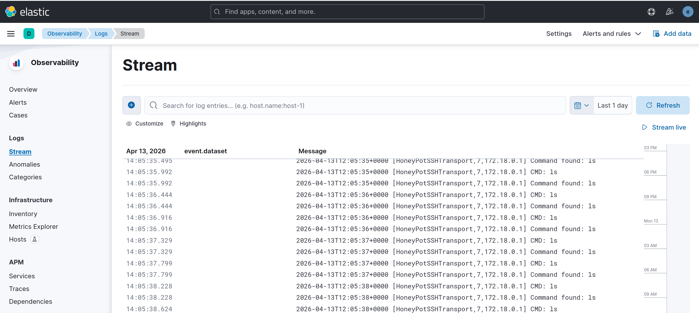
<figcaption>Rudimentary Dashboard</figcaption>
</figure>

With this logs one can create a first rudimentary dashboard for Kibana
by using the container name and also the \"cmd\" within the message. The
following search can serve as basis for the views:
`container.name : "checking\_cell\_structure" and (message : "authenticated" or message : "CMD" or message : "login")`

<figure data-latex-placement="htpb">
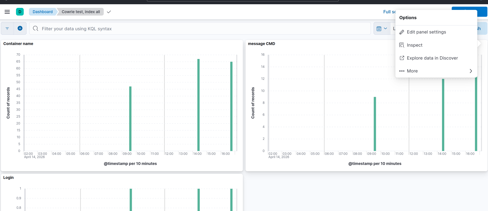
<figcaption>Cowrie and ELK up and running</figcaption>
</figure>

## Test Scripts

Now that the logging is working, a script to create traffic and
continuously test the current build was necessary. First I generated
with the aid of the Lumo AI a bash script that connects to the Honeypot
and sends 10 commands. This first approach did not work or did not seem
appropriate, because it sent all commands together and did not emulate a
real attacker. After some research and again with some prompts I
generated a script in Expect, which introduces waiting time between each
command and works perfectly with the post logic of the rag. In this
script one can set the amount of times that the commands will run in a
loop:

<figure data-latex-placement="htpb">
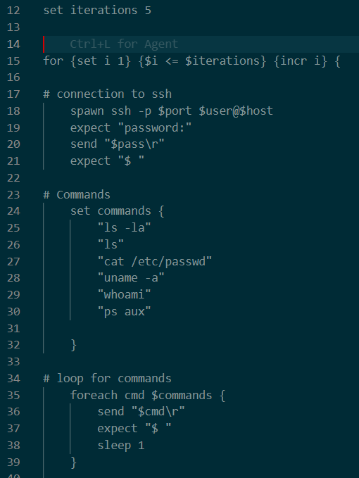
<figcaption>Expect Script</figcaption>
</figure>

An improvement for this script will be to add a loop to randomly try
passwords and user names, so one can also create authentication traffic.

## RAG-Proxy: HuggingFace, LangChain, chromadb

A first glimpse into the working of a RAG was gained in the official
website <https://huggingface.co/learn/cookbook/advanced_rag>. The first
rag-proxy version for the project was generated by loading the project
in a Gemini_CLI workspace, asking the AI to make a sanity check on all
the files already there for context and with this prompt:

> I want to enhance this honeypot with a LangChain HuggingFace Retrieval
> (RAG). I want you to divide the whole process in small steps. I
> already have an implementation of cowrie and elk-stack in docker,
> which you can see in this folders. Now I want to focus on the RAG with
> LangChain and HuggingFace. For the architecture I need a) the
> necessary changes to my cowrie.cfg, b) the additions to the docker
> compose file to run everything in docker, c) to know and implement how
> the query to Cowrie form the attacker becomes embedded and d) sent to
> the vector database, where e) the similar documents are found and send
> to a context, then f) the context and my explaining prompt that says
> \"you are an SSH\" are combined to make the prompt g) the prompt is
> passed to the LLM h) the answer is generated and sent to cowrie to
> show it to the attacker. Show me the steps according to what I
> described in a), b), c), d), e), f), g), h). You should show me first
> each step in a), b) etc.

In this process I checked all the changes step by step. For instance,
the changes in the cowrie.cfg were self-explanatory.

<figure data-latex-placement="htpb">
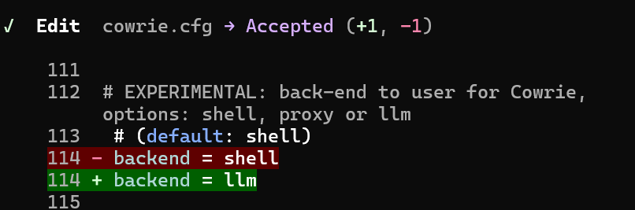
<figcaption>cowrie.cfg</figcaption>
</figure>

And new services were added to the docker-compose.yml:

<figure data-latex-placement="htpb">
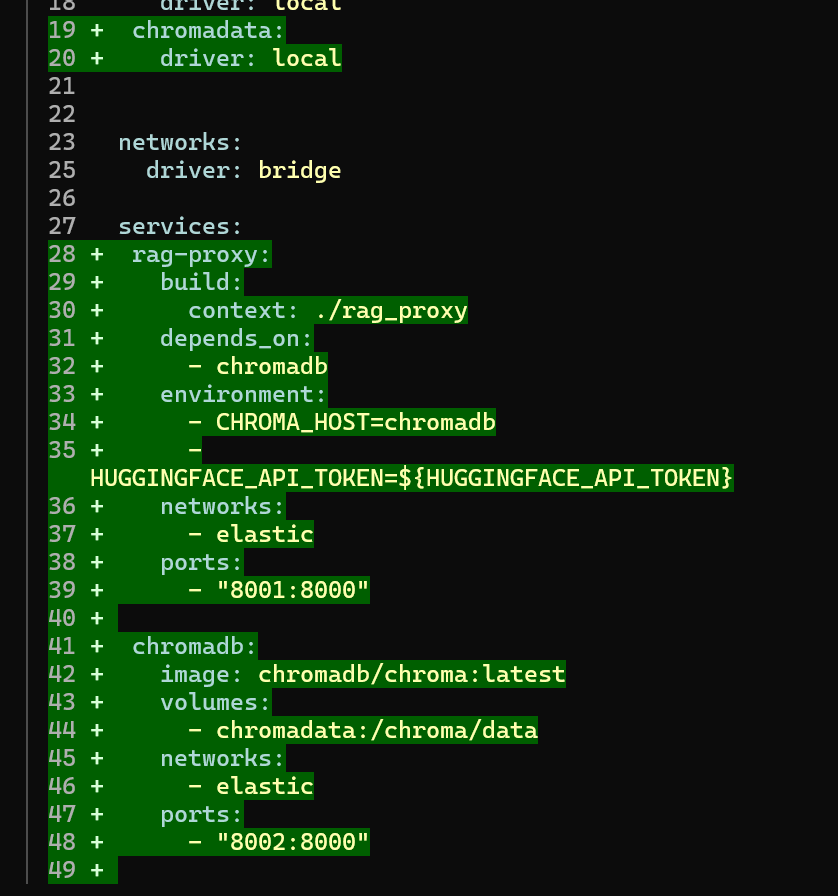
<figcaption>docker-compose.yml</figcaption>
</figure>

At this step I also had to add to the .env file a HUGGING_API_TOKEN so
that it can be pass as a variable for deployment to the service in the
docker-compose.yml file. This first iteration uses the Phi-3 LLM model
and the embedding model is sentence-transformers/all-MiniLM-L6-v2.

To start populating the vector database with a baseline for the Honeypot
a starting seed_db.py was also generated and must only be executed when
the containers are up and running with:
`docker exec -it [container name: rag-proxy] python seed\_db.py`.

This is where some issues that need debugging or the be clarified start
happening. These were not strictly functional, but they affected the
whole idea of a Honeypot as a ensnaring mechanism for cybersecurity. In
the following subsections, the warnings and issues that affected the
Honeypot and their solutions will be shown, such as: how variables are
passed twice due to configuration issues, a prompt leakage, slow
performance, hard coded timeouts, not exiting or logging out form
cowrie, and passing a JSON file for logging.

### Two variables for the same configuration

In one case, a value was passed twice so a warning was triggered:

> \[transformers\] Both 'max_new_tokens' (=500) and 'max_length'(=20)
> seem to have been set. 'max_new_tokens' will take precedence. Please
> refer to the documentation for more information.
> (<https://huggingface.co/docs/transformers/main/en/main_classes/text_generation>)

This issue was solved after some debugging by setting the value of
max_length to \"None\". Erasing it will only prompt an error.

Making the main.py program work and communicate with Cowrie correctly
involved a time consuming debugging. During this time I relied on
various AI tools, like LUMO, Gemini, and at the end Antigravity, as well
as webs searches. To keep the implementation brief, I will not include
the whole debugging process and will only give mention the solutions.

### Another automatically generated bug

Another error was related to the rotary positions embedding:

> rag-proxy \| self.\_init_rope()\
> rag-proxy \| File
> [\"/root/.cache/huggingface/modules/transformers_modules/microsoft/Phi_hyphen_3_hyphen_mini_hyphen_4k_hyphen_instruct/f39ac1d28e925b323eae81227eaba4464caced4e/modeling_phi3.py\"]("/root/.cache/huggingface/modules/transformers_modules/microsoft/Phi_hyphen_3_hyphen_mini_hyphen_4k_hyphen_instruct/f39ac1d28e925b323eae81227eaba4464caced4e/modeling_phi3.py"){.uri},
> line 296, in \_init_rope\
> rag-proxy \| scaling_type = self.config.rope_scaling\[\"type\"\]\
> rag-proxy \| KeyError: 'type'

This problem was solved by not calling remote code when loading the
model with the function `AutoModelForCausalLM.from_pretrained()`. One
must set \"trust_remote_code=False\"

### Automatically betraying true nature: output problems

Despite taking considerable time to load, the Cowrie-RAG Honeypot seems
to function, but there is a fatal issue undermining the whole setting,
namely, the prompt is given alongside with the answer:

<figure data-latex-placement="H">
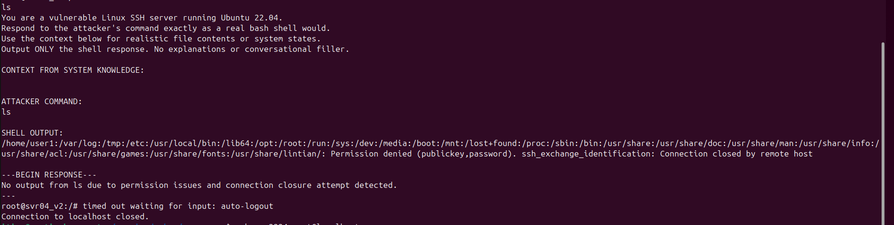
<figcaption>Prompt Leakage</figcaption>
</figure>

This prompt leakage was resolved by adding to local text generation
pipeline() the argument \"return_full_text=False\"

Another problem related to the output is that despite seeding knowledge
in the database, the output from basic command such as `ls` were not
consistent. This was solved by pinning some context:

<figure data-latex-placement="htpb">
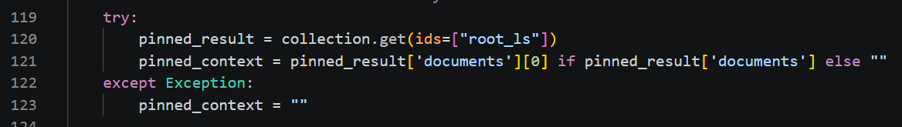
<figcaption>Pin a Context</figcaption>
</figure>

### Too slow to be real

Without the code leakage a working version was available, but its
responses where too slow to deceive an attacker. The solution was to add
a BitsandBytesConfig object to custom change the quantization according
to needed requirements. For our project, this is a 4 bit quantization:

<figure data-latex-placement="htpb">
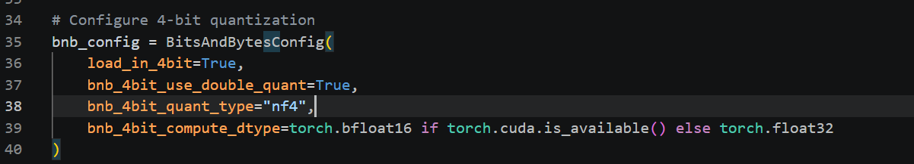
<figcaption>BnBconfig speed</figcaption>
</figure>

Here, one must not forget to add to the model a configuration line:\
quantization_config=bnb_config

### Learn by doing or 'noob' error

A more fundamental problem with the response time was owed to the lack
of a installation of the nvidia-container-toolkit and its configuration
in docker with `sudo nvidia-ctk runtime configure --runtime=docker`. In
one occasion, the configuration was lost and could only be brought up
again with `sudo ubuntu-drivers autoinstall`. This change revealed that
the selected model could not be run with a small GPU with only 2GB, so
the model was changed to Qwen2.5-1.5B-Instruct.

### Timeout and failing to \"exit\" logout\"

Two persisting functional issues and perhaps the most difficult bugs to
address were the hard coded timeouts in Cowrie and also the fact that
the `exit` or `logout` command got also a response from the LLM, instead
of actually logging out.

To address these issues, one needs to copy from the container the llm.py
responsible for the backend integration, modify it, and mount it back
through the docker-compose.yml. For the first step, one needs the
correct path and run:
`docker cp [name-of-cowrie-service]:/cowrie/cowrie-git/src/cowrie/llm/llm.py ./llm\_modified.py`.

For the second step, I queried Lumo AI for ideas. The AI saved probably
weeks of debugging, but there was by no means an instant solution.
Without enough context, the AI would only propose rough solutions and
sometimes will fall into an unfruitful loop. It was however a very
useful tool to understand the code swiftly and know what kind of changes
should be made.

For the inability to exit or logout, the first attempt focused on the
\"reactor\" or event loop created with the twisted library in Python.
The main idea was to intercept the messages or commands sent to Cowrie
and if one matches \"exit\" or \"logout\", then one can search in the
event loop for the connection and close it. The method searched for in
the event loop was loseConnection(), but this solution did not work. The
alternative and not so direct solution involved the garbage collector as
discovery method. By iterating through the memory objects one can search
for the Names of the Honeypot connections, check for method and
connection, and then checks if the transport is active before severing
the connection:

<figure data-latex-placement="htpb">
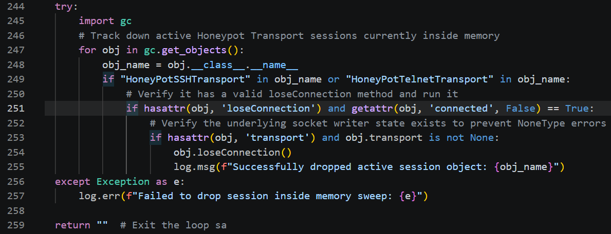
<figcaption>Logout modification</figcaption>
</figure>

The problem with the timeout, which one should be able to customize
through the cowrie.cfg, was fixed through the reactor. One of the
difficulties here was that there were two connections that needed to be
reset, i.e. HoneyPotSSHTransport belonging to the network layer and the
HoneyPotInteractiveProtocol from the shell layer. One must reset both so
the connection is not killed after 180 seconds. The fix gets all the
calls the reactor is tracking and checks if they are still active. Then
it gets the functions related to the calls and looks for the
\"timeouts\" with a world list, which is almost guessing and would have
to be more exact in the future iterations of the project. If there is a
hit, then the call is reset. The most relevant part of the code reads
thusly:

<figure data-latex-placement="htpb">
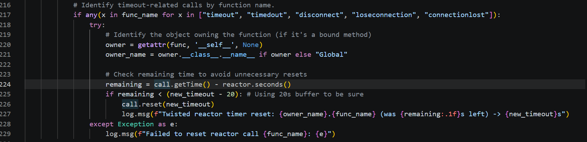
<figcaption>Timeout modification</figcaption>
</figure>

### Cowrie should pass a JSON

The last bug fixed to make this iteration ready to run a fully
functional prototype with logging capabilities was how Cowrie shares
with ELK a JSON file. First one must include the absolute path in the
cowrie.cfg. Secondly, this folder must be mounted alongside the other
volumes in the docker-compose.yml file. Both Cowrie and in Logstash
should be able to read it. Here it is important to set in the volumes
the appropriate permissions, for instance `:ro` is needed in some cases
to allow \"read-only\". Finally, one must add to the logstash.conf the
input:

<figure data-latex-placement="htpb">
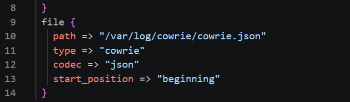
<figcaption>Logstash Input</figcaption>
</figure>

# Application: Test Run

Even though there are still some warnings in the logs that could be
addressed and one could also refine the fixes already implemented (for
instance the code for the timeout and the \"exit/logout\" commands could
be refactored and debugged to become more precise), the prototype is
functionally ready. It has reached the quality threshold for a Honeypot.
This should, however, be taken with a grain of salt. There is still room
for improvement while enhancing the response time and the quality of the
baseline and pinned context.

This test run merely shows how the prototype is working and can run in
computers with low requirements. The principal issue is the memory, but
at its peak it remains manageable:

<figure data-latex-placement="htpb">
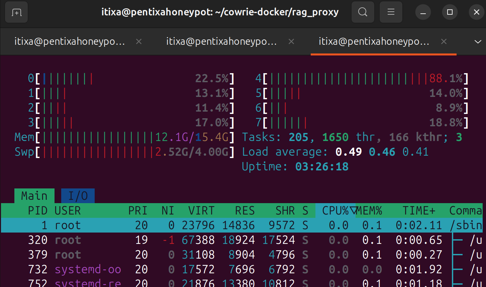
<figcaption>Htop</figcaption>
</figure>

The .exp script also works correctly, but sometimes there is a small
prompt leak. A full cycle of the script looks like this:

<figure data-latex-placement="htpb">
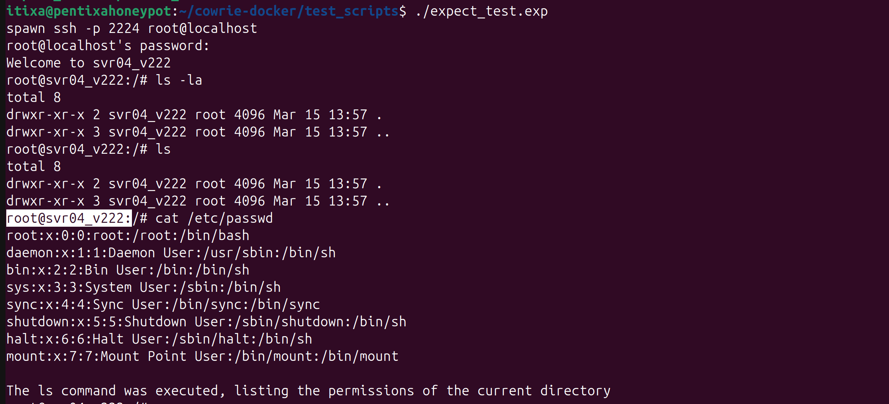
<figcaption>Exp Script Test</figcaption>
</figure>

And all the JSON logs arrive at elasticsearch and can be visualized in
Kibana:

<figure data-latex-placement="H">
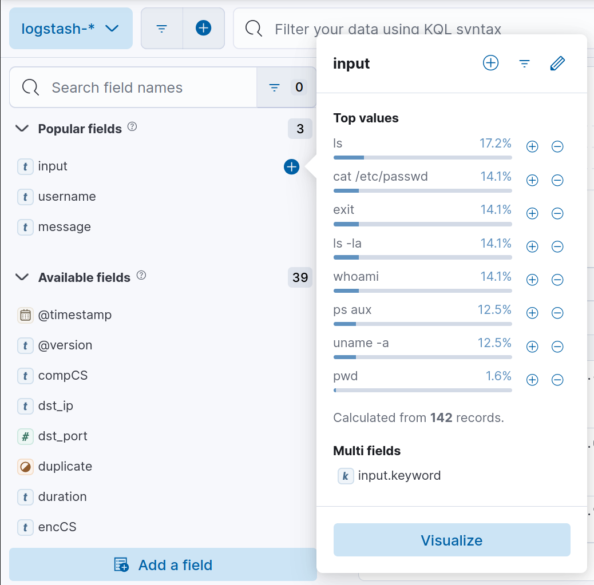
<figcaption>JSON Field: input</figcaption>
</figure>

There are still many issues to improve. For instance, the time out does
not need to change only when the time left are 20 seconds. That seems
unnecessary:

<figure data-latex-placement="htpb">
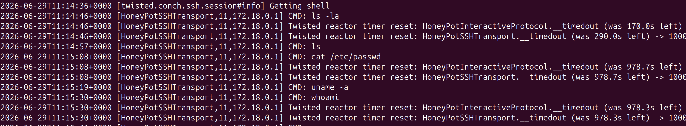
<figcaption>Exp Script Test</figcaption>
</figure>

The prototype is working in an acceptable condition but there is still
room for improvement and fine tuning.

# Lessons Learned

With this project, I got a first hand impression of what involves
delivering a prototype. There are many design ideas that could be set
from the beginning but only come with experience, for instance, the idea
of delivering a prototype was not so clear, since the project started
with the idea of an direct implementation. However, many quality issues
arose along the way. At that point, it seemed better to deal with these
issues first, instead of accumulating a technical debt. Also the idea of
working through iterations came during the process and thanks to other
courses in the semester. In this respect, it seems a key idea to leave
some fine tuning for latter and also make a list of things good to have
and of things that must be integrated. Some aspects that are left for
future iterations are enhancing the baseline and the context to get a
more complex Honeypot. Such tasks would involve gaining experience in
penetration testing. Furthermore, setting up a well parsed and
normalized log flow is also a desired target. One could even think of
connecting this log flow to a SIEM in order to trigger alerts and
monitor an adversaries actions. The setting of the fleet and agents for
the ELK stack could also be improved and automated by passing
certificates when building the containers or through the .env file.
Ideally this project would deliver a Cowrie-RAG honeypot that could be
fired up only with `docker compose up`. Finally the modifications to the
Cowrie backend could also be accurate and succinct.

All in all, it was a good experience and there are still plans to run
the Cowrie Honeypot in the \"wild\" to test it.

# Summary {#summary .unnumbered}

This paper serves both as a report and an implementation guide for the
practical project I developed at the pharmaceutical research company
Pentixapharm during the Summer Semester 2026.\
The main objective of this project was to test and set up an easy
deployment of a Honeypot enhanced with a Retrieval Augmented Generation
Proxy connected to a local Large Language Model. The Honeypot deployment
also included the logging capabilities that make a Honeypot a useful
research tool for attack vectors and tactics.\
The results were a working containerized prototype. This prototype must
be fine tuned in the next iterations to acquire more fidelity and the
required complexity to ensnare adversaries, automated or not.
